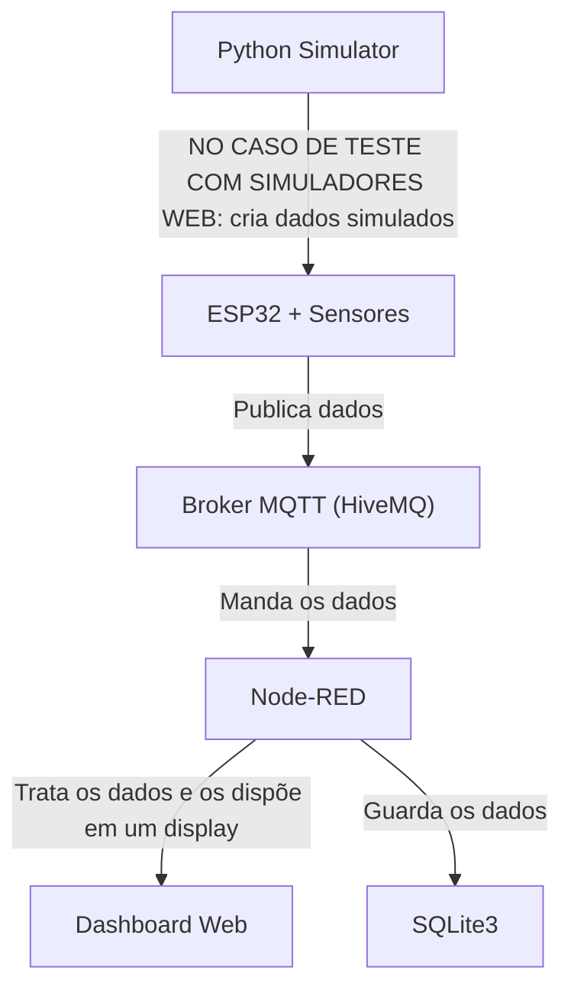

# Sprint-3-IOT-WWT

## Link do projeto no wokwi: [https://wokwi.com/projects/432784932341371905](https://wokwi.com/projects/442760478935109633)

## 👨‍💻 Integrantes do Grupo
| Nome           | RM        |
|----------------|-----------|
| Daniel Akiyama | RM 558263 |
| Danilo Correia | RM 557540 |
| João Pedro R   | RM 558199 |

## 🚀 IoT - Monitoramento de Motos em Pátio

Este projeto demonstra um **sistema IoT de monitoramento de motos** utilizando sensores físicos (ou simulados), comunicação MQTT e um **dashboard no Node-RED** para visualização em tempo real de motos em um pátio.

---

## 📖 Visão Geral
A solução monitora o status de motos em um pátio através de diferentes sensores, enviando os dados para um **broker MQTT**, que posteriormente são consumidos pelo **Node-RED** e exibidos em um dashboard web.

O sistema detecta:
- 📍 **Localização GPS** da moto.  
- 📏 **Distância/proximidade** da vaga usando ultrassônico.  
- 📈 **Movimento/posição** via acelerômetro.  
- 🚨 **Alarme** sonoro (simulado com buzzer).  

---

## 🔧 Tecnologias Utilizadas
- **ESP32 / Arduino IDE** → microcontrolador para ler sensores e publicar via MQTT. 
- **Sensores**:
  - GPS NEO-6M → para monitorar a posição da moto no pátio
  - Ultrassônico HC-SR04 → para monitorar a distância da moto
  - Acelerômetro MPU6050 → para monitorar a velocidade da moto
  - Buzzer (atuador) → Para servir de alarme
- **Protocolos**: MQTT (via [HiveMQ Broker](https://www.hivemq.com/public-mqtt-broker/))  
- **Node-RED + Dashboard** → exibição dos dados e testes de casos de uso.  
- **Python + Paho-MQTT** (opcional) → simulação de dados.
- **Banco de dados(SQLite3)** → Armazenamento de dados.

---

## 📡 Arquitetura

Objetivo do fluxo:
Receber os dados publicados pelo ESP32 no tópico leitura/qr via MQTT, exibir no debug e em um dashboard.

- Simulador e banco escrito em Python são executados em conjunto com o esp32

- O Esp32 se conecta ao Wi-Fi

- Se conecta ao broker MQTT público (broker.hivemq.com)

- Usa os sensores, no caso de testes os dados são criados aleatóriamente por um código Python, para captar as informações

- Publica os dados nos tópicos MQTT: moto/gps, moto/proximidade, moto/movimento, moto/alarme

- Os dados são exebidos em um display

### 📚 Bibliotecas

#### 🤖 ESP32
- PubSubClient: para MQTT

- WiFi.h: para Wi-Fi

- TinyGPSPlus

- Adafruit MPU6050

- Adafruit Unified Sensor

#### 🐍 Python
- paho.mqtt.client
  
- time
  
- random
  
- json
  
- sqlite3

### 🟥 NODE-RED
#### 🧰 Pré-requisitos
- Node-RED instalado e em execução [(http://localhost:1880)](http://127.0.0.1:1880/)

- Um broker MQTT acessível (broker.hivemq.com)

- Dashboard instalado via Manage Palette (node-red-dashboard)

MQTT In: Conecta ao broker MQTT e escuta o tópicos moto.

Dashboard: Exibe os dados em forma de gráficos, string e velocidade.
